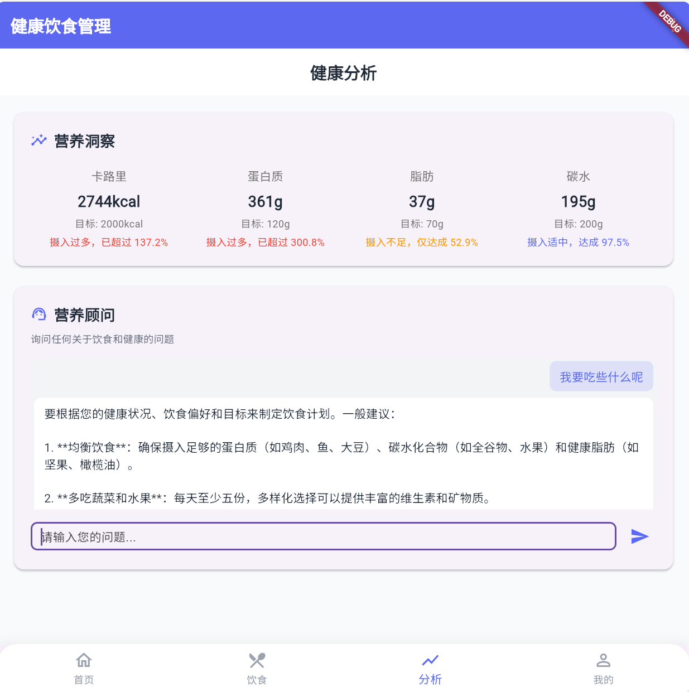

# Nutritrack - 智能饮食营养追踪与健康管理App 🍏📊

Nutritrack 是一款基于 Flutter 框架开发的跨平台（iOS & Android）移动应用程序，旨在为用户提供全面、便捷的饮食记录、精准的营养分析与个性化的健康管理工具。本项目为课程设计作业。

---

## 目录 📚

*   [✨ 项目特色](#-项目特色)
*   [🎯 目标用户](#-目标用户)
*   [🚀 技术栈](#-技术栈)
*   [🛠️ 系统架构](#️-系统架构)
    *   [前端架构](#前端架构)
    *   [后端架构](#后端架构)
    *   [数据库架构](#数据库架构)
*   [📸 应用截图](#-应用截图)
*   [🏁 开始使用](#-开始使用)
    *   [环境要求](#环境要求)
    *   [安装步骤](#安装步骤)
    *   [运行项目](#运行项目)
*   [⚙️ 主要功能模块](#️-主要功能模块)
*   [🛡️ 安全设计](#️-安全设计)
*   [⚡ 性能优化](#️-性能优化)
*   [🧪 测试策略](#-测试策略)
*   [📅 项目规划](#-项目规划)
*   [👥 团队成员](#-团队成员)
*   [🤝 贡献指南 ](#-贡献指南)

---

## ✨ 项目特色

*   **便捷记录**: 支持手动输入、食物库搜索、条形码扫描等多种饮食记录方式。
*   **精准分析**: 基于权威食物数据库，自动计算卡路里、宏量与微量营养素。
*   **个性建议**: 结合用户健康目标与饮食数据，提供科学的饮食调整建议。
*   **目标追踪**: 用户可设定健康目标（如卡路里、蛋白质摄入），并可视化跟踪进度。
*   **数据洞察**: 通过图表清晰展示饮食模式、营养趋势，助力用户理解健康状况。
*   **跨平台**: 基于 Flutter 开发，一套代码库支持 iOS 和 Android 双平台。

---

## 🎯 目标用户

*   **健身爱好者与运动人群**: 需要精确控制营养摄入。
*   **体重管理者**: 进行减肥、增重或维持体重的个人。
*   **健康饮食关注者**: 希望改善饮食习惯、确保营养均衡的用户。
*   **特定饮食需求者**: 如需监控糖分、钠等特定营养素摄入的用户。
*   **数字化健康管理工具爱好者**: 偏好使用移动应用管理个人健康信息的人群。

---

## 🚀 技术栈

*   **前端**: Flutter (Dart 语言)
*   **后端**: Firebase (Cloud Functions, Authentication, Firestore)
*   **数据库**: Firebase Firestore
*   **UI/UX 设计**: [  Figma  ]
*   **版本控制**: Git & GitHub

---

## 🛠️ 系统架构

Nutritrack 采用前后端分离的架构，确保了系统的可扩展性和可维护性。

### 前端架构

客户端采用 Flutter 开发，实现了跨平台特性，主要模块包括：首页、饮食记录、健康报告、用户中心。通过 HTTPS 与后端进行安全的数据交互。

### 后端架构

后端服务主要依托 Firebase 平台：

*   **Firebase Authentication**: 用于用户注册、登录和身份验证管理。
*   **Cloud Firestore**: 作为实时 NoSQL 数据库，存储用户个人信息、饮食记录、健康目标、食物数据等。
*   **Cloud Functions for Firebase**: 用于执行后端逻辑，如复杂的营养计算、生成个性化建议、与第三方API（如果需要）的集成等。

<p align="center">
  
</p>
<p align="center"><em>系统组件图 (Firebase 架构)</em></p>

### 数据库架构

采用 Firebase Cloud Firestore 作为主要的数据库。数据以集合（Collections）和文档（Documents）的形式进行组织，具有良好的可伸缩性和实时同步能力。主要集合可能包括：

*   `users`: 存储用户账户信息和个人偏好。
*   `dietRecords`: 存储用户的每日饮食记录。
*   `foodDatabase`: （如果自建）存储食物的营养信息，或用于缓存常用食物数据。
*   `healthGoals`: 存储用户的健康目标。

---

## 📸 应用截图

<table>
  <tr>
    <td align="center"><br /><sub><b>首页</b></sub></td>
    <td align="center"><br /><sub><b>饮食记录</b></sub></td>
  </tr>
  <tr>
    <td align="center"><br /><sub><b>个人信息</b></sub></td>
    <td align="center"><br /><sub><b>分析报告</b></sub></td>
  </tr>
</table>


---

## 🏁 开始使用

### 环境要求

*   Flutter SDK: `^3.x.x`
*   Dart SDK: `^3.x.x`
*   Android Studio 或 VS Code
*   Firebase CLI (确保已安装并登录: `firebase login`)
*   一个 Firebase 项目，并为 Android 和 iOS 应用进行了相应配置。

### 安装步骤

1. **克隆仓库**:

   ```bash
   git clone https://github.com/AIZ2201/Nutritrack.git
   cd Nutritrack
   ```

2. **安装 Flutter 依赖**:

   ```bash
   flutter pub get
   ```

3. **配置 Firebase**:

   * 访问 [Firebase 控制台](https://console.firebase.google.com/) 并创建一个新项目（或使用现有项目）。

   * 在项目设置中，为 Android 应用添加你的包名 (`applicationId` 通常在 `android/app/build.gradle` 中找到) 并下载 `google-services.json` 文件，将其放置在 `android/app/` 目录下。

   * 为 iOS 应用添加你的 Bundle ID (通常在 Xcode 中设置) 并下载 `GoogleService-Info.plist` 文件，将其放置在 `ios/Runner/` 目录下 (建议通过 Xcode 添加以确保正确链接)。

   * 确保在 Firebase 控制台中启用了所需的服务，如 Authentication, Firestore, Cloud Functions。

   * 如果使用了 Cloud Functions，请根据 `firebase.json` 和函数代码部署它们：

     ```bash
     cd functions # (如果你的functions在单独的目录)
     npm install # (或 yarn install)
     firebase deploy --only functions
     cd ..
     ```

### 运行项目

* **选择设备**: 连接真实设备或启动模拟器/仿真器。

* **运行应用**:

  ```bash
  flutter run
  ```

---

## ⚙️ 主要功能模块

1.  **食物记录模块**: 手动输入、拍照上传（若实现）、语音输入（若实现）、条形码扫描，自动识别与提取营养成分。
2.  **营养分析模块**: 计算并分析食物营养成分，评估饮食是否符合健康标准。
3.  **健康目标管理模块**: 设置个人健康目标（卡路里、体重等），追踪进展并提供反馈。
4.  **个性化饮食建议模块**: 根据用户数据提供定制化饮食建议。
5.  **数据可视化模块**: 图表化展示饮食数据和健康进展。
6.  **用户账户与设置模块**: 用户注册、登录 (Firebase Authentication)，个人信息管理、数据同步。

---

## 🛡️ 安全设计

* **身份认证与权限控制**: Firebase Authentication 提供安全的电子邮件/密码登录、社交媒体登录（可选）和多因素认证（MFA）支持。

* **数据传输安全**: Flutter 与 Firebase 之间的所有通信均通过 HTTPS 加密。

* **数据存储加密**: Firestore 在服务器端自动加密所有数据。对于客户端的额外敏感信息，可考虑应用层加密。

* **Firestore 安全规则**: 通过在 Firebase 控制台配置 Firestore 安全规则，精细化控制对数据库中每个集合和文档的读写权限，确保用户只能访问其自身数据。

  ```javascript
  // 示例 Firestore 安全规则
  rules_version = '2';
  service cloud.firestore {
    match /databases/{database}/documents {
      // 用户只能读写自己的饮食记录
      match /dietRecords/{userId}/{recordId} {
        allow read, write: if request.auth != null && request.auth.uid == userId;
      }
      // 用户只能读写自己的个人信息
      match /users/{userId} {
        allow read, update, delete: if request.auth != null && request.auth.uid == userId;
        allow create: if request.auth != null;
      }
      // 公共食物数据库（如果存在）可被所有认证用户读取
      match /foodDatabase/{foodId} {
        allow read: if request.auth != null;
        // 可能只有管理员可写
        // allow write: if request.auth != null && request.auth.token.admin == true;
      }
    }
  }
  ```

* **输入验证**: 在 Flutter 客户端和 Cloud Functions（如果业务逻辑复杂）中进行输入验证，防止无效数据。

---

## ⚡ 性能优化

*   **应用缓存机制**: 客户端使用如 `shared_preferences` 或 `sqflite` 缓存常用食物数据、用户配置等；利用 Flutter 的图片缓存机制。
*   **Firestore 查询优化**:
    *   为常用查询字段创建索引（Firestore 会自动创建单字段索引，复杂查询需手动创建复合索引）。
    *   精确设计查询，避免不必要的数据读取。
    *   使用分页加载数据（`limit()` 和 `startAfter()`）。
*   **Cloud Functions 优化**:
    *   选择合适的区域以减少延迟。
    *   优化函数代码，减少冷启动时间。
    *   管理第三方 API 调用，使用缓存或批量操作。
*   **前端性能优化**: 减少Widget重建、使用高效Widgets (如 `ListView.builder`)、优化图片资源、懒加载、使用 `compute` 或 `Isolate` 处理耗时任务。
*   **利用 Flutter DevTools**: 定期分析应用的性能（CPU, 内存, 渲染）。

---

## 🧪 测试策略

*   **单元测试**: 使用 `flutter_test` 对 Dart/Flutter 代码中的业务逻辑、工具函数、模型类进行测试。
*   **Widget 测试**: 使用 `flutter_test` 测试单个 Widget 的 UI 和交互。
*   **集成测试**: （可选，对于 Flutter 和 Firebase 集成可能较复杂）测试应用模块间的交互，或 Flutter 应用与 Firebase 后端的模拟交互。
*   **Cloud Functions 测试**: 使用 Firebase Emulator Suite 在本地模拟和测试 Cloud Functions。
*   **手动系统测试**: 在真实设备或模拟器上进行端到端测试，覆盖主要用户场景。
*   **性能监测**: 使用 Firebase Performance Monitoring 监控应用的性能指标。

---

## 📅 项目规划

项目遵循敏捷开发流程，主要阶段包括：

1.  需求分析与原型设计 (3.10 – 4.6)
2.  系统设计 (4.7 – 4.20)
3.  程序设计 (4.21 – 5.4)
4.  代码实现 (5.5 – 5.18)
5.  测试阶段 (5.19 – 6.1)
6.  验收与发布 (6.2 – 6.8)

<p align="center">
  
</p>
<p align="center"><em>项目规划甘特图</em></p>

---

## 👥 团队成员

*   09022217 汪毅书
*   09022230 韩潇康
*   09022236 周方昱
*   09022212 吴中亚
*   09022331 肖 岩
*   09022108 王 烨

---

## 🤝 贡献指南 (可选)

虽然这主要是一个课程作业，但如果你有兴趣改进或修复 Bug，欢迎：

1.  Fork 本仓库。
2.  创建一个新的分支 (`git checkout -b feature/YourImprovement`)。
3.  提交你的更改 (`git commit -m 'Add some YourImprovement'`)。
4.  推送到分支 (`git push origin feature/YourImprovement`)。
5.  开启一个 Pull Request 进行讨论。

---

> Nutritrack - 记录每一口，健康每一步。